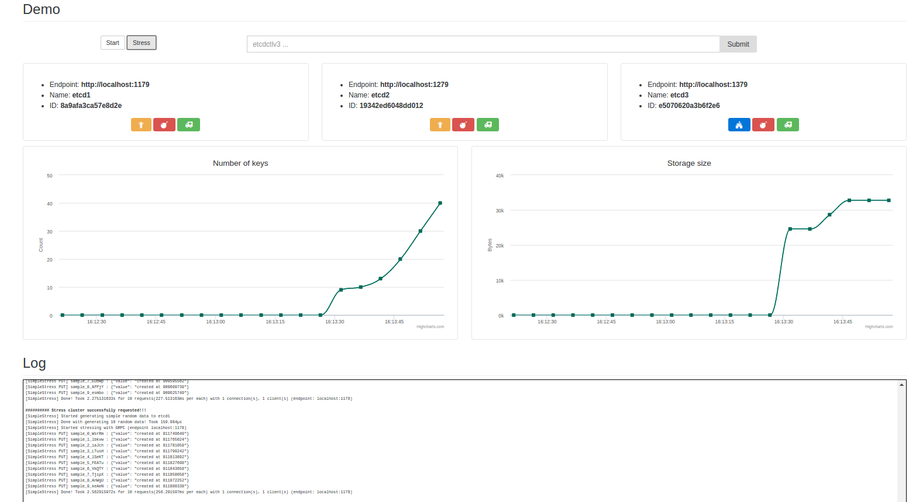
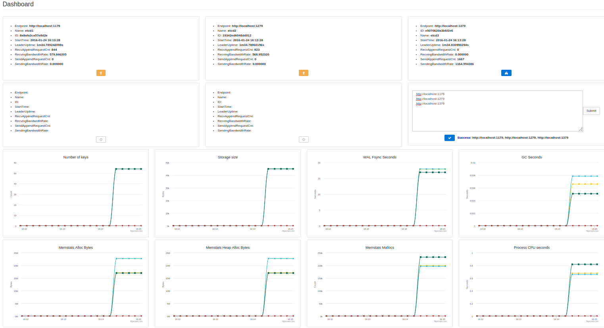
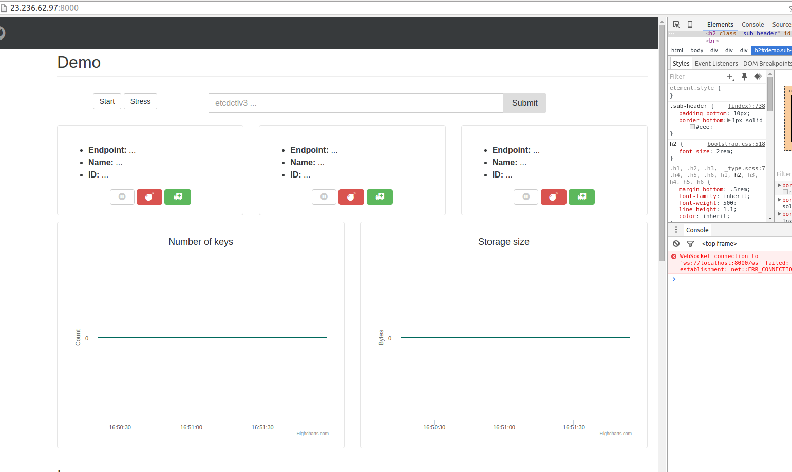
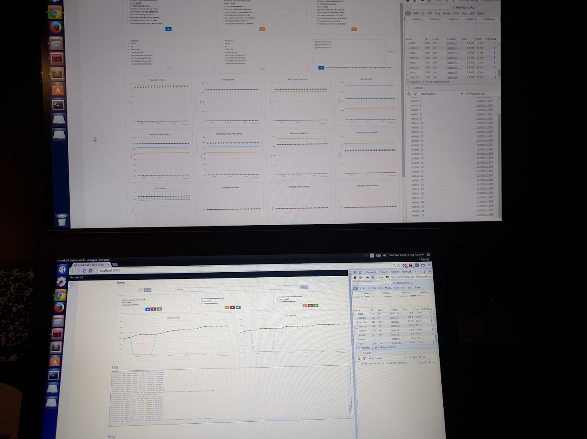
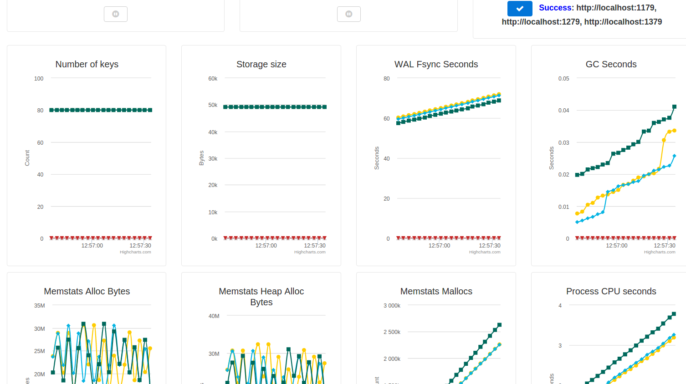
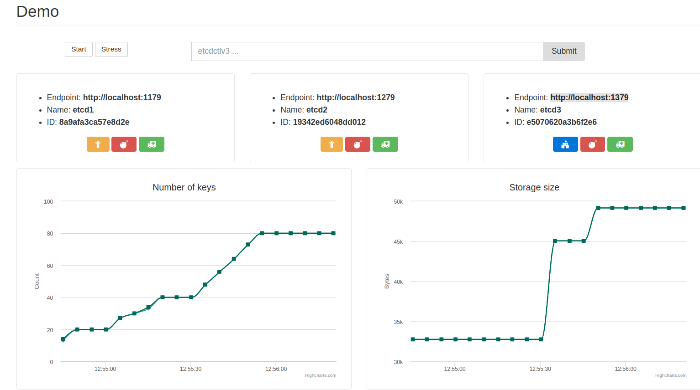

I dumped a lot of code without much documentation and optimization. There are LOTS OF things to improve. I am now losing write access to this repository. And I will keep working on this even after this Hackathon. Further work will be continued at https://github.com/gyuho/runetcd.


## runetcd [](https://travis-ci.org/gophergala2016/runetcd) [](https://godoc.org/github.com/gophergala2016/runetcd)

**Distributed Reliable Key-Value Store `etcd` Visualized**
<br>

`runetcd` runs, demos [`etcd`](https://github.com/coreos/etcd) with CLIs and dashboards.

- [Why](#why)
- [**_10-second Demo_**](#10-second-demo)
- [Dashboard for production](#dashboard-for-production)
- [Credits](#credits)
- [Progress](#progress)

[↑ top](#runetcd--)
<br><br>


## Why

- http://try.redis.io
- http://play.golang.org

So must `etcd` be easy to try and play.

[↑ top](#runetcd--)
<br><br>


## 10-second Demo

Public demo here https://runetcd.io. (Fixing DNS issue right now. Please
run locally for now. Sorry)

Please visit http://23.236.62.97:8000/ in the meantime.



It runs exactly the same `etcd` cluster as in production. Each client launches
N number of machines and writes to the distributed database.

Distributed database does A LOT OF RPC calls. So it's very easy to overload
`runetcd.io`, even though it has resources limits that can be used. To
experience full-powered `etcd`, PLEASE run CLI locally. And here's how:

```
go get -v github.com/gophergala2016/runetcd
runetcd demo-web -b $GOPATH/src/github.com/gophergala2016/runetcd/bin/etcd

# or specify your etcd binary path

# or to run quick simulation in terminal
runetcd demo
# cluster start, fail, recover, stress, put, range, watch, ...
```

It's that easy! Just etcd binary and internet connection for javascript
libraries. In the future, I may get rid of javascript dependency using
https://github.com/rakyll/statik.

[↑ top](#runetcd--)
<br><br>


## Dashboard for production

You can use this as an `etcd` dashboard:

```
go get -v github.com/gophergala2016/runetcd
runetcd dashboard

# and type your etcd client endpoints
```



[↑ top](#runetcd--)
<br><br>


## Credits

- https://github.com/coreos/etcd
- https://github.com/mattn/goreman

And other external dependencies:

```
go get -v -u github.com/Sirupsen/logrus
go get -v -u github.com/coreos/etcd/Godeps/_workspace/src/golang.org/x/net/context
go get -v -u github.com/coreos/etcd/Godeps/_workspace/src/google.golang.org/grpc
go get -v -u github.com/coreos/etcd/client
go get -v -u github.com/coreos/etcd/etcdserver/etcdserverpb
go get -v -u github.com/dustin/go-humanize
go get -v -u github.com/fatih/color
go get -v -u github.com/gorilla/websocket
go get -v -u github.com/gyuho/psn/ss
go get -v -u github.com/satori/go.uuid
go get -v -u github.com/spf13/cobra
go get -v -u github.com/tylerb/graceful
go get -v -u golang.org/x/net/context
```

[↑ top](#runetcd--)
<br><br>


## Progress

##### Sun January 24 2016 16:25 PM

Deploy!

```bash
sudo vi /etc/security/limits.conf;

# add the following lines
* soft nofile 120000
* hard nofile 120000

# and reboot the machine
# or log out/in

ulimit -Sn


sudo apt-get -y install git;
sudo apt-get -y install screen;

echo "[user]
  email = gyuhox@gmail.com
  name = Gyu-Ho Lee
[color]
  diff = auto
  status = auto
  branch = auto
  ui = auto" > $HOME/.gitconfig;

git config --global user.name "Gyu-Ho Lee";
git config --global user.email "gyuhox@gmail.com";
git config --global core.editor "vim";

cd $HOME && \
mkdir -p $HOME/go/src && \
mkdir -p $HOME/go/src/github.com && \
mkdir -p $HOME/go/src/github.com/coreos && \
mkdir -p $HOME/go/src/github.com/gyuho && \
mkdir -p $HOME/go/src/golang.org;

# install latest go
cd /usr/local && sudo rm -rf ./go;
sudo curl -s https://storage.googleapis.com/golang/go1.6beta2.linux-amd64.tar.gz | sudo tar -v -C /usr/local/ -xz;


if grep -q GOPATH "$(echo $HOME)/.bashrc"; then 
	echo "bashrc already has GOPATH...";
else
	echo "adding GOPATH to bashrc...";
	echo "export GOPATH=$(echo $HOME)/go" >> $HOME/.bashrc && \
	PATH_VAR=$PATH":/usr/local/go/bin:$(echo $HOME)/go/bin" && \
	echo "export PATH=$(echo $PATH_VAR)" >> $HOME/.bashrc && \
	source $HOME/.bashrc;
fi

cd $HOME && \
printf "package main\n\nimport \"fmt\"\n\nfunc main() {\n\tfmt.Println(\"Successfully installed Go.\")\n}" > $HOME/temp.go;
cd $HOME && go run temp.go && rm -f temp.go && go version;


go get -v github.com/gophergala2016/runetcd
runetcd demo-web -b $GOPATH/src/github.com/gophergala2016/runetcd/bin/etcd
```

Need to figure out web socket issue... but running out of time...



<br><br><br>
##### Sun January 24 2016 14:20 PM

Almost done. Dashboard, demo-web both working good.



<br><br><br>
##### Sun January 24 2016 12:58 PM

Finish dashboard backend.




<br><br><br>
##### Sun January 24 2016 10:31 AM

Outlined dashboard frontend.


<br><br><br>
##### Sun January 24 2016 05:02 AM

Added `etcdctlv3` interface!


<br><br><br>
##### Sun January 24 2016 02:50 AM

Re-organize packages.


<br><br><br>
##### Sun January 24 2016 00:07 AM

Add help page!


and break time...


<br><br><br>
##### Sat January 23 2016 11:20 PM

Real-time metrics graphs up and running!


<br><br><br>
##### Sat January 23, 2016 07:17 PM

Better node status display!


<br><br><br>
##### Sat January 23, 2016 05:30 PM

Got some realtime updates, logs up and running!


<br><br><br>
##### Sat January 23, 2016 03:15 AM

CLI demo done!


[↑ top](#runetcd--)
<br><br>
