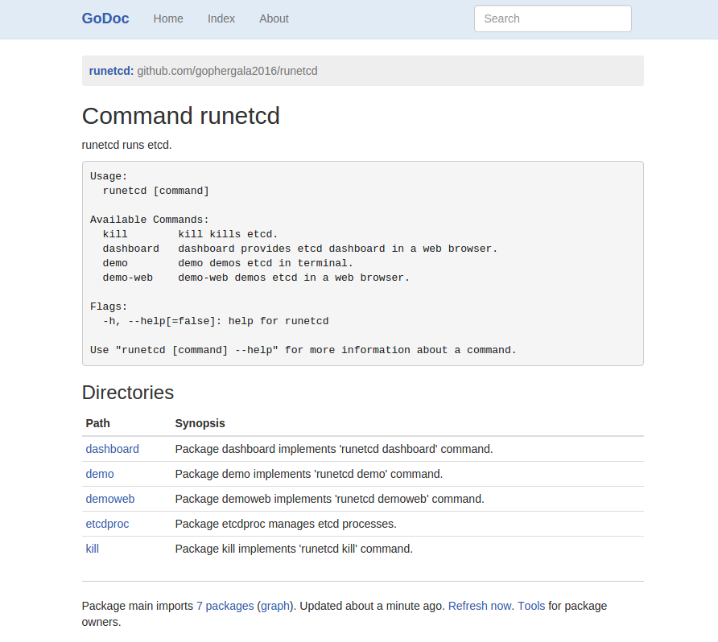

## runetcd [](https://travis-ci.org/gophergala2016/runetcd) [](https://godoc.org/github.com/gophergala2016/runetcd)

**Distributed Reliable Key-Value Store `etcd` Visualized**
<br>

`runetcd` runs, demos [`etcd`](https://github.com/coreos/etcd) with CLIs and dashboards.

- [Why](#why)
- [**_10-second Demo_**](#10-second-demo)
- [Dashboard for production](#dashboard-for-production)
- [Credits](#credits)
- [Progress](#progress)

[↑ top](#runetcd--)
<br><br>


## Why

- http://try.redis.io
- http://play.golang.org

So must `etcd` be easy to try and play.

[↑ top](#runetcd--)
<br><br>


## 10-second Demo

Public demo here https://runetcd.io.

```
gif...
```

It runs exactly the same `etcd` cluster as in production. Each client launches
N number of machines and writes to the distributed database.

Distributed database does A LOT OF RPC calls. So it's very easy to overload
`runetcd.io`, even though it has resources limits that can be used. To
experience full-powered `etcd`, PLEASE run CLI locally. And here's how:

```
commands...

```

It's that easy! Just etcd binary, nothing else. You don't even need Internet
connection.

[↑ top](#runetcd--)
<br><br>


## Dashboard for production

You can use this as an `etcd` dashboard:

```

```

[↑ top](#runetcd--)
<br><br>


## Credits

- https://github.com/coreos/etcd
- https://github.com/rakyll/statik
- https://github.com/mattn/goreman

And other external dependencies:

```
go get -v -u github.com/Sirupsen/logrus
go get -v -u github.com/coreos/etcd/Godeps/_workspace/src/golang.org/x/net/context
go get -v -u github.com/coreos/etcd/Godeps/_workspace/src/google.golang.org/grpc
go get -v -u github.com/coreos/etcd/client
go get -v -u github.com/coreos/etcd/etcdserver/etcdserverpb
go get -v -u github.com/dustin/go-humanize
go get -v -u github.com/fatih/color
go get -v -u github.com/gorilla/websocket
go get -v -u github.com/gyuho/psn/ss
go get -v -u github.com/satori/go.uuid
go get -v -u github.com/spf13/cobra
go get -v -u golang.org/x/net/context
```

[↑ top](#runetcd--)
<br><br>


## Progress

<br><br><br>
##### Sun January 24 2016 10:31 AM

Outlined dashboard frontend.


<br><br><br>
##### Sun January 24 2016 05:02 AM

Added `etcdctlv3` interface!


<br><br><br>
##### Sun January 24 2016 02:50 AM

Re-organize packages.



<br><br><br>
##### Sun January 24 2016 00:07 AM

Add help page!


and break time...


<br><br><br>
##### Sat January 23 2016 11:20 PM

Real-time metrics graphs up and running!


<br><br><br>
##### Sat January 23, 2016 07:17 PM

Better node status display!


<br><br><br>
##### Sat January 23, 2016 05:30 PM

Got some realtime updates, logs up and running!


<br><br><br>
##### Sat January 23, 2016 03:15 AM

CLI demo done!


[↑ top](#runetcd--)
<br><br>
